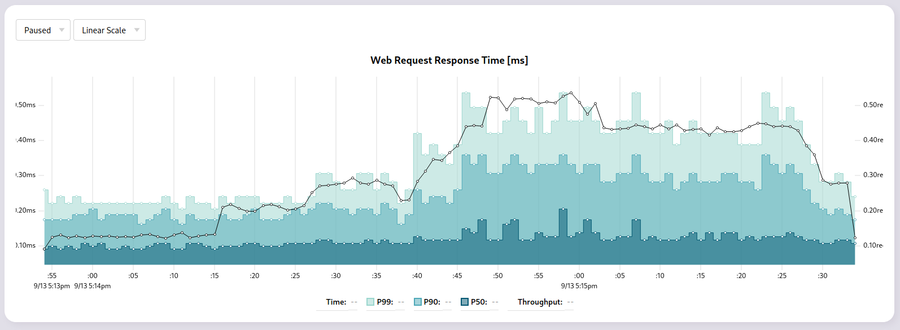
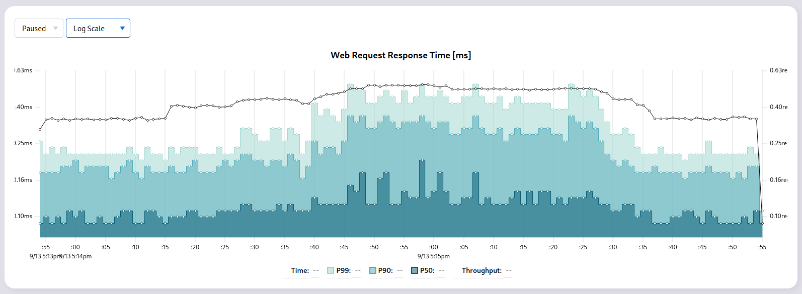

## Linear Scale


## Log Scale


# Phoenix Web Response Time Graphs

✅ Very very low overhead (powered by [DogSketch](https://github.com/moosecodebv/dog_sketch))
✅ Cluster-wide performance charts (not just a single node!)
✅ No external dependencies (runs 100% in-BEAM)
✅ Accurate p50, p90, p99 and throughput
✅ Linear and Log scale

# Installation

1. Add `spotlight` to your list of dependencies
2. Configure LiveView (if you haven't already)
3. Add spotlight to your Phoenix router

## 1. Add `spotlight` to your list of dependencies

Add to `mix.exs`:

```elixir
def deps do
  [
    {:spotlight, "~> 0.1.0"}
  ]
end
```

Then run `mix deps.get`.

## 2. [Configure LiveView (if you haven't already)](https://hexdocs.pm/phoenix_live_view/installation.html)

## 3. Add `spotlight` to your Phoenix router

```elixir
# lib/my_app_web/router.ex
use MyAppWeb, :router
import SpotlightWeb.Router

...

scope "/" do
  pipe_through :browser
  spotlight("/spotlight")
end
```

We heavily recommend that you put Spotlight behind some kind of authentication before adding it to your production servers.
